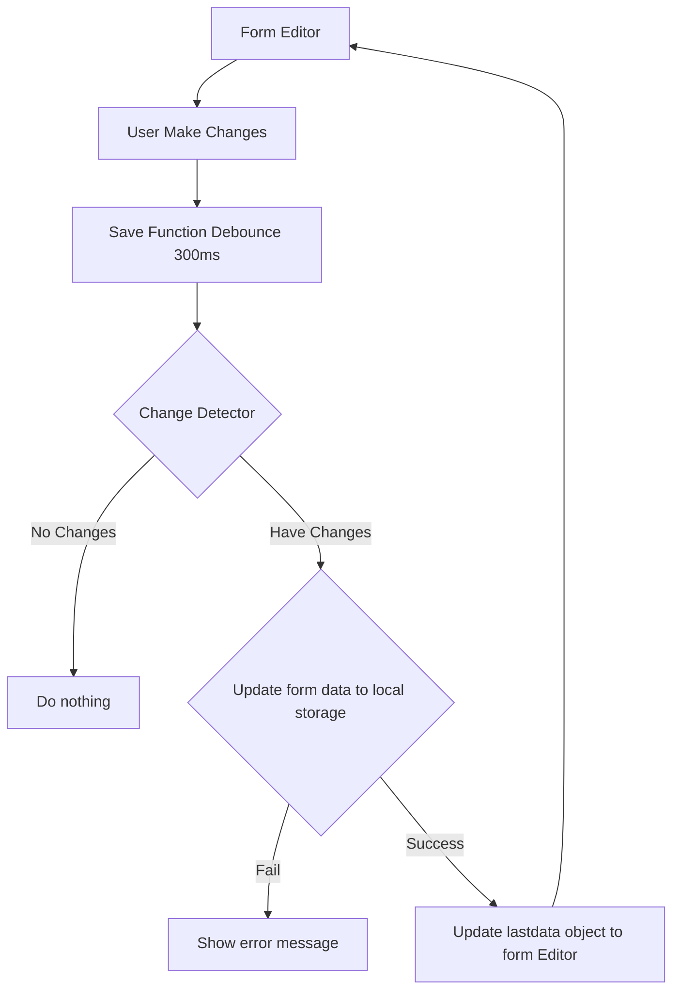
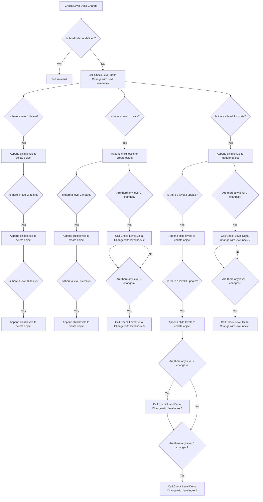
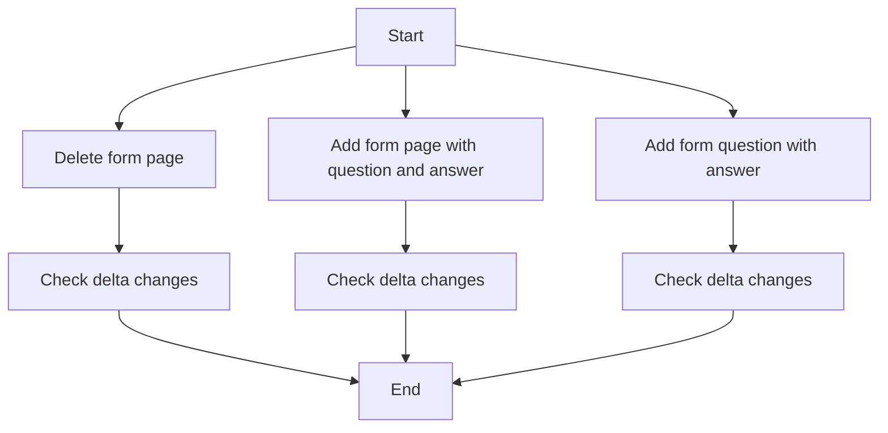

```All data used by app
    Form,
    FormPage,
    FormQuestion,
    FormStatus,
    InspectionProperty,
    Inspection,
    Workflow,
    FormUserAnswer,
    FormUserAnswerQuestion,
    FormQuestionAnswer,
    FormUserAnswerQuestionImage,
    FormUserAnswerQuestionOption,
    SignatureImage,
```

From object

```js
const formObject = {
  formPages: [
    {
      formQuestions: [
        {
          formPageId: 142,
          isMandatory: false,
          isActive: true,
          isAllowComment: false,
          isMultiAnswer: false,
          isIncludeTime: false,
          isImage: false,
          labelFrom: '',
          labelTo: '',
          questionType: {
            id: 1,
            name: ' Multiple Choice',
          },
          answers: [
            {
              description: '121',
            },
          ],
          description: 'hghg',
        },
      ],
      name: 'Page 1',
      id: 1,
    },
  ],
  formName: 'General',
  id: 1,
};
```

To object

```js
const toObject = {
  formPages: [
    {
      formQuestions: [
        {
          formPageId: 142,
          isMandatory: false,
          isActive: true,
          isAllowComment: false,
          isMultiAnswer: false,
          isIncludeTime: false,
          isImage: false,
          labelFrom: '',
          labelTo: '',
          questionType: {
            id: 1,
            name: ' Multiple Choice',
          },
          answers: [
            {
              description: '121',
            },
          ],
          description: 'hghg',
        },
      ],
      name: 'Page 1',
      id: 1,
    },
  ],
  formName: 'General2',
  id: 1,
};
```

Output

```js
const result = [
  {
    formPage: {
      created: [],
      updated: [
        {
          id: 1,
          name: 'Page 1',
        },
      ],
      deleted: [],
    },
  },
];
```

    expected to when detect

    {
        formPage: {
            created: [],
            updated: [],
            deleted: [],
        },
          formQuestion: {
            created: [],
            updated: [],
            deleted: [],
        },
          formStatus: {
            created: [],
            updated: [],
            deleted: [],
        },
          formUserAnswer: {
            created: [],
            updated: [],
            deleted: [],
        },
          formUserAnswerQuestion: {
            created: [],
            updated: [],
            deleted: [],
        },
         formUserAnswerQuestionOption: {
            created: [],
            updated: [],
            deleted: [],
        },

    }

Flow chart

Overview chart



Detail chart




